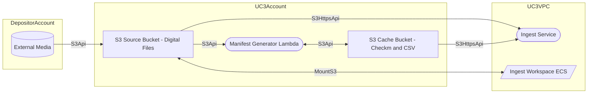

# Manifest Generator Use Case 1: UC3-Owned Source Bucket

- [Merritt Manifest Generator](README.md)

## Purpose
- This solution will replace the existing Ingest Workspace Manifest Generator ([s3-sinatra](https://github.com/CDLUC3/s3-sinatra)) with a general purpose application.

## Diagram



## Configuration Needs
- IngestWorkspaceEC2 needs S3 read/write access to S3SourceBucket
- ManifestGeneratorLambda needs S3 read/list access to S3SourceBucket
- ManifestGeneratorLambda needs S3 read/write access to S3CacheBucket
- Ingest needs s3https read access to S3SourceBucket
- Ingest needs s3https read access to S3CacheBucket

## Testing in Docker Compose
- Share AWS credentials to docker-compose to convey S3 access rights

```bash
PROJECT_NAME=xxx docker compose up -d --build
```