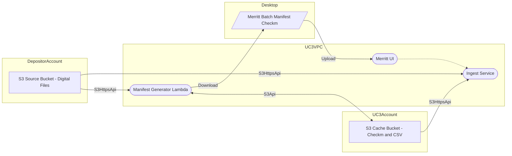

# Manifest Generator Use Case 2: Depositor-Owned Source Bucket

- [Merritt Manifest Generator](README.md)

## Diagram



## Configuration Needs
- ManifestGeneratorLambda needs s3https read/list access to S3SourceBucket
- ManifestGeneratorLambda needs S3 read/write access to S3CacheBucket
- Ingest needs s3https read access to S3SourceBucket
- Ingest needs s3https read access to S3CacheBucket

## Testing in Docker Compose
- Share AWS credentials to docker-compose to convey S3 access rights for the S3CacheBucket
- Run docker compose from an DEV Workspace in order to enable S3httpsapi access

```bash
PROJECT_NAME=xxx docker compose -f docker-compose.yml -f use-case-2.yml up -d --build
```