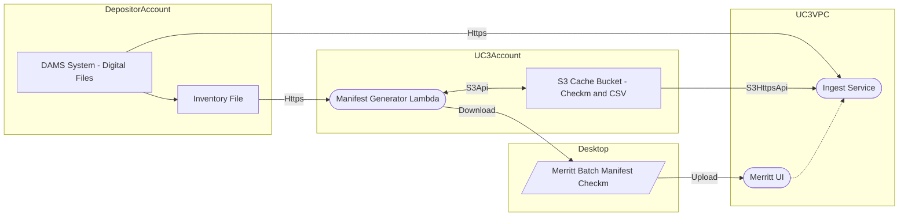

# Manifest Generator Use Case 3: Inventory File Solution

- [Merritt Manifest Generator](README.md)

## Diagram

## Testing in Docker Compose
- Share AWS credentials to docker-compose to convey S3 access rights for the S3CacheBucket
- Eventually the application will be modified to use a file system rather than the S3CacheBucket
